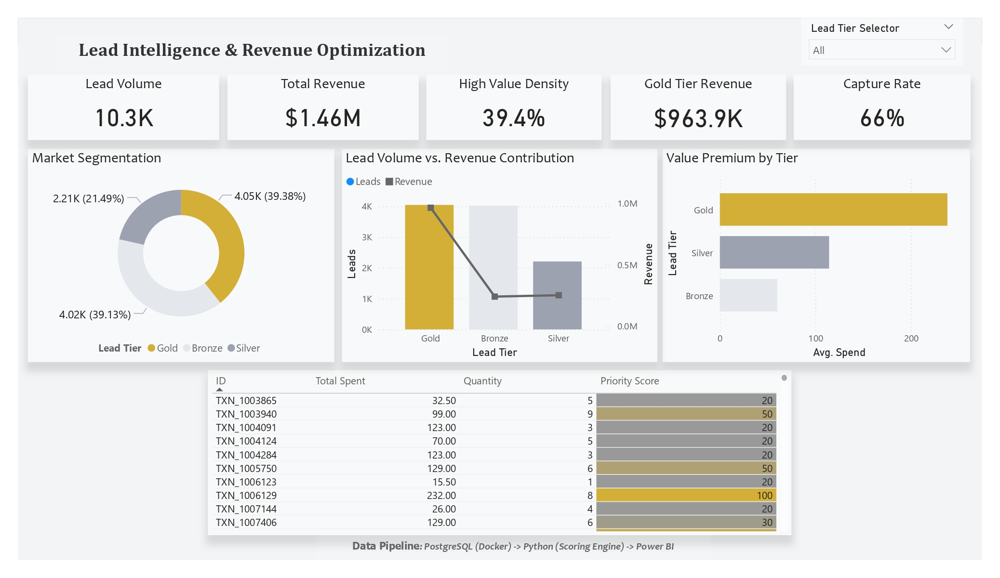

# Lead Intelligence & Revenue Optimization Engine

### 📊 Project Overview
This end-to-end data pipeline was built to solve a common business problem: Lead Noise. By integrating a PostgreSQL database with a custom Python scoring engine and Power BI, this system identifies high-value "Gold" leads that drive the majority of business revenue.

### 🚀 Key Performance Indicators (The Result)
* Total Market Value: $1.46M

* High-Value Density: 39.4% (The "Gold" segment)

* Revenue Capture Rate: 66.0%

* Efficiency Gain: Identified 60.6% of leads as "low-priority," allowing sales teams to focus on the top 39% of the database while retaining 66% of potential revenue.

### 🛠️ The Tech Stack
* Database: PostgreSQL 18.3 (Deployed via Docker)

* Orchestration & ETL: Python 3.x

* Libraries: Pandas, SQLAlchemy, Psycopg2

* Visualization: Power BI Desktop

* Design Philosophy: Minimalist Executive Reporting

### 🧠 Methodology: The Scoring Engine
The core of this project is a Python-based **Lead Segmenter** that ranks leads based on a weighted average of their total spend and purchase frequency relative to the population mean.

The scoring logic follows:
$$Score = (w_1 \cdot \text{Normalized Spend}) + (w_2 \cdot \text{Normalized Quantity})$$

**Leads are tiered into three segments:**
* **Gold:** Top ~40% of scorers (The Revenue Drivers).
* **Silver:** Mid-tier consistent performers.
* **Bronze:** High-volume, low-value leads.


### 📂 Project Structure
```bash
.
├── data/               # Enriched CSV exports for Power BI
├── scripts/
│   ├── db_setup.py     # Database schema and initialization
│   ├── segmenter.py    # The Python Scoring Engine logic
│   ├── exporter.py     # SQL to CSV pipeline
│   └── config.py.example # Template for DB credentials
├── docker-compose.yml  # Infrastructure as Code (Postgres 18)
├── .gitignore          # Keeps secrets (config.py) out of GitHub
└── README.md           # Project Documentation
```

### 💡 Business Impact
Instead of a "spray and pray" sales approach, this engine provides an Actionable Target List. The final dashboard includes a "Priority Score" visual that highlights the specific Transaction IDs (TXN) that the sales team should contact immediately, maximizing ROI per hour spent on outreach.

### 🛠️ How to Reproduce
1. Clone the Repo: git clone https://github.com/Jows1/lead-intelligence-engine.git

2. Configure: Rename config.py.example to config.py and add your credentials.

3. Spin up the DB: docker-compose up -d (Runs on Localhost:5433)

4. Run the Pipeline: python scripts/segmenter.py

5. Visualize: Import the generated CSVs into Power BI.